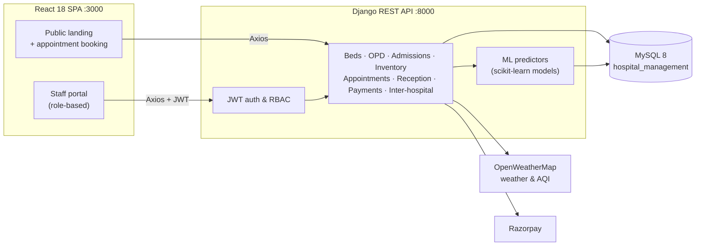

<div align="center">

# 🏥 Hospital Operations Sync Platform

### Software syncing hospital operations for a healthier city

A real-time hospital operations platform that improves patient flow and resource utilisation —
live bed availability, a smart OPD queue, admissions, ML-powered inventory forecasting,
inter-hospital capacity sharing and a full reception & billing portal, in one modern, animated interface.


</div>

---

## 📑 Table of contents

- [Highlights](#-highlights)
- [UI & design](#-ui--design)
- [Tech stack](#-tech-stack)
- [Architecture](#-architecture)
- [Project structure](#-project-structure)
- [Getting started](#-getting-started)
- [Environment variables](#-environment-variables)
- [Roles & access](#-roles--access)
- [API overview](#-api-overview)
- [Machine learning](#-machine-learning)
- [Documentation](#-documentation)
- [Security](#-security)

---

## ✨ Highlights

| Module | What it does |
|---|---|
| 🌐 **Public website** | Animated landing page for patients with services, departments and **online appointment booking**. |
| 🔐 **Staff authentication** | JWT login with automatic token refresh and **role-based access** for Admin, Doctor, Nurse, Receptionist and Pharmacist. |
| 📊 **Operations dashboard** | Live KPIs (beds, OPD load, admissions, low stock), an occupancy ring and department-wise bed occupancy — auto-refreshes every 30 s. |
| 🩺 **Dynamic OPD queue** | Real-time check-ins, doctor-specific queues and **ML-predicted wait times**. |
| 📅 **Appointments** | Review, approve and edit bookings made from the public site. |
| 🛏️ **Bed management** | Ward and bed status by department, with admission/discharge updates. |
| 🏨 **Admissions** | Rule-based intake that matches patient needs to available beds. |
| 💊 **Inventory** | Usage tracking, low-stock alerts, **stock-depletion forecasting** and **weather/AQI-aware disease demand** predictions. |
| 🌆 **Inter-hospital sharing** | Anonymised capacity data for a city-wide health dashboard. |
| 🧾 **Reception portal** | Billing, transactions, treatments and **profit/loss prediction**, with **Razorpay** payments. |

---

## 🎨 UI & design

The frontend ships with its own lightweight design system — no UI framework required.

- **Design tokens** — clinical blue / care-teal palette, *Plus Jakarta Sans* + *Inter* typography, soft slate-tinted shadows and generous radii, all as CSS variables in [`frontend/src/index.css`](frontend/src/index.css).
- **Motion library** — reusable `hx-*` keyframes for route transitions, scroll-reveal, count-up numbers, ECG heartbeat lines, shimmer skeletons, spring modals and pulsing "live" indicators. Everything respects `prefers-reduced-motion`.
- **App shell** — dark glass sidebar with animated active states, frosted header with live clock and greeting, and an off-canvas drawer on tablets and phones.
- **Landing page** — animated gradient hero with live-vitals mock-up, counting stats, cursor-spotlight service cards, an infinite departments marquee and a booking CTA.
- **Login** — split-screen layout with animated brand panel, password visibility toggle, loading state and shake-on-error feedback.
- **Dashboard** — gradient hero with an animated occupancy ring, staggered KPI cards, animated occupancy bars and skeleton loading (no flicker on background refresh).
- **Reusable components** — `Card`, `AnimatedNumber`, `Reveal`, `Button`, `Table`, `StatusBadge` in [`frontend/src/components/Common`](frontend/src/components/Common).

---

## 🧱 Tech stack

| Layer | Technology |
|---|---|
| Frontend | React 18, React Router 6, Axios, Recharts, CSS variables + custom animation library |
| Backend | Django 4.2, Django REST Framework, Simple JWT, django-cors-headers, python-decouple |
| Database | MySQL 8 (`mysqlclient`) |
| Machine learning | scikit-learn, NumPy, joblib (pre-trained models in [`models/`](models)) |
| Integrations | OpenWeatherMap (weather & AQI), Razorpay (payments) |

---

## 🗺️ Architecture



---

## 📁 Project structure

```
Hospital-Operations-Sync-Platform/
├── backend/                    # Django REST API
│   ├── apps/
│   │   ├── authentication/     # JWT login, staff users & roles
│   │   ├── dashboard/          # Operations summary endpoints
│   │   ├── opd/                # OPD queue + wait-time predictions
│   │   ├── appointments/       # Online booking & approvals
│   │   ├── beds/               # Bed & ward management
│   │   ├── admissions/         # Inpatient admissions & discharges
│   │   ├── inventory/          # Stock, ML depletion & weather-aware demand
│   │   ├── interhospital/      # City-wide capacity sharing
│   │   ├── receptionist/       # Billing, transactions, profit/loss predictor
│   │   ├── payments/           # Razorpay integration
│   │   └── patients/           # Patient records
│   ├── hospital_ops/           # Django settings & URL routing
│   ├── requirements.txt
│   └── .env.example            # Backend environment template
├── frontend/                   # React single-page app
│   ├── public/
│   ├── src/
│   │   ├── components/         # Layout, Sidebar, Navbar, modals, Common UI kit
│   │   ├── hooks/              # useInView (scroll reveal)
│   │   ├── pages/              # Landing, Login, Dashboard, OPD, Beds, Inventory, …
│   │   ├── services/api.js     # Axios client with JWT refresh
│   │   └── index.css           # Design tokens & motion library
│   └── .env.example            # Frontend environment template
├── models/                     # Pre-trained ML models (.pkl)
├── docs/                       # API, auth, schema & feature guides
├── dump.sql                    # MySQL schema + sample data
├── start.bat / start.ps1       # One-click start on Windows
└── package.json                # Root scripts (backend + frontend together)
```

---

## 🚀 Getting started

### Prerequisites

- **Python** 3.10+
- **Node.js** 18+ and npm
- **MySQL** 8

### 1. Clone the repository

```bash
git clone https://github.com/kushal-s0/Hospital-Operations-Sync-Platform.git
cd Hospital-Operations-Sync-Platform
```

### 2. Create your environment files

```bash
# Windows (PowerShell):  Copy-Item backend/.env.example backend/.env
cp backend/.env.example backend/.env
cp frontend/.env.example frontend/.env
```

Fill in your own values — see [Environment variables](#-environment-variables).

> ⚠️ `.env` files are git-ignored. **Never commit real credentials.**

### 3. Set up the database

```sql
CREATE DATABASE hospital_management CHARACTER SET utf8mb4 COLLATE utf8mb4_unicode_ci;
```

```bash
mysql -u root -p hospital_management < dump.sql
```

### 4. Run the backend

```bash
cd backend
python -m venv venv
venv\Scripts\activate          # macOS/Linux: source venv/bin/activate
pip install -r requirements.txt
python manage.py migrate
python manage.py runserver      # http://localhost:8000
```

### 5. Run the frontend

```bash
cd frontend
npm install
npm start                       # http://localhost:3000
```

### ⚡ One-command start

| Option | Command |
|---|---|
| Windows batch | double-click **`start.bat`** |
| PowerShell | run **`start.ps1`** |
| npm (both servers, one terminal) | `npm install` then `npm start` from the repo root |

Open **http://localhost:3000** for the public website; staff sign in at **`/login`**.
Local test accounts are listed in [`QUICKSTART.md`](QUICKSTART.md).

---

## 🔧 Environment variables

### `backend/.env`

| Variable | Description | Example |
|---|---|---|
| `DB_ENGINE` | Django database backend | `django.db.backends.mysql` |
| `DB_NAME` | Database name | `hospital_management` |
| `DB_USER` / `DB_PASSWORD` | MySQL credentials | `root` / *your password* |
| `DB_HOST` / `DB_PORT` | MySQL host & port | `localhost` / `3306` |
| `SECRET_KEY` | Django secret key (generate a unique one) | — |
| `DEBUG` | Debug mode — **`False` in production** | `True` |
| `OPENWEATHER_API_KEY` | [OpenWeatherMap](https://openweathermap.org/api) key for weather & AQI predictions | — |
| `RAZORPAY_PUBLIC_KEY` | Razorpay key ID (use test mode for development) | `rzp_test_…` |
| `RAZORPAY_SECRET_KEY` | Razorpay key secret | — |
| `RAZORPAY_WEBHOOK_SECRET` | Razorpay webhook secret (optional) | — |

Generate a Django secret key:

```bash
python -c "from django.core.management.utils import get_random_secret_key; print(get_random_secret_key())"
```

### `frontend/.env`

| Variable | Description | Default |
|---|---|---|
| `PORT` | Dev-server port | `3000` |
| `BROWSER` | Auto-open a browser (`none` disables) | `none` |
| `REACT_APP_API_URL` | Backend API base URL | `http://localhost:8000/api` |

---

## 👥 Roles & access

| Module | Admin | Doctor | Nurse | Receptionist | Pharmacist |
|---|:---:|:---:|:---:|:---:|:---:|
| Dashboard | ✅ | ✅ | ✅ | ✅ | ✅ |
| OPD Queue | ✅ | ✅ | ✅ | ✅ | — |
| Appointments | ✅ | — | ✅ | ✅ | — |
| Bed Management | ✅ | — | ✅ | ✅ | — |
| Admissions | ✅ | — | ✅ | ✅ | — |
| Inventory | ✅ | — | — | ✅ | ✅ |
| Inter-Hospital | ✅ | — | — | — | — |
| Reception portal (billing, transactions, treatments) | ✅ | — | — | ✅ | — |

---

## 🔌 API overview

All endpoints are served under `http://localhost:8000`.

| Prefix | Purpose |
|---|---|
| `/api/auth/` | Login, logout, current user |
| `/api/auth/token/refresh/` | Refresh a JWT access token |
| `/api/dashboard/` | Summary & department occupancy |
| `/api/patients/` | Patient records |
| `/api/opd/` | OPD queue & wait-time predictions |
| `/api/appointments/` | Appointment booking & management |
| `/api/beds/` | Beds & wards |
| `/api/admissions/` | Admissions & discharges |
| `/api/inventory/` | Stock, transactions & forecasts |
| `/api/interhospital/` | Shared capacity data |
| `/api/receptionist/` | Billing, transactions, treatments, profit/loss |
| `/api/payments/` | Razorpay orders & verification |
| `/admin/` | Django admin |

Full reference: [`docs/API.md`](docs/API.md).

---

## 🤖 Machine learning

Pre-trained models live in [`models/`](models) and are loaded with `joblib` at request time.

| Feature | Models | Used by |
|---|---|---|
| OPD wait-time prediction | `wait_time_prediction_model.pkl`, `wait_time_scaler.pkl`, `wait_time_features.pkl` | `apps/opd` |
| Stock depletion & availability | `stock_depletion_regressor.pkl`, `stock_availability_classifier.pkl`, scalers, `stock_prediction_features.pkl`, `category_encoder.pkl` | `apps/inventory/ml_predictor.py` |
| Profit / loss areas | `profit_model.pkl`, `loss_area_model.pkl` | `apps/receptionist/profit_loss_predictor.py` |
| Weather & AQI disease demand | Rule-based, powered by OpenWeatherMap | `apps/inventory/weather_predictor.py` |

---

## 📚 Documentation

| Guide | Description |
|---|---|
| [QUICKSTART.md](QUICKSTART.md) | Fastest way to run the project & test accounts |
| [docs/API.md](docs/API.md) | REST API reference |
| [docs/AUTHENTICATION.md](docs/AUTHENTICATION.md) | JWT auth & staff login |
| [docs/DATABASE_SCHEMA.md](docs/DATABASE_SCHEMA.md) | Database tables |
| [docs/OPD_NURSE_FEATURES.md](docs/OPD_NURSE_FEATURES.md) | OPD queue features |
| [RAZORPAY_PAYMENT_INTEGRATION.md](RAZORPAY_PAYMENT_INTEGRATION.md) | Payment setup |
| [docs/LOGIN_TROUBLESHOOTING.md](docs/LOGIN_TROUBLESHOOTING.md) | Fixing login issues |

---

## 🔐 Security

- Secrets belong **only** in `backend/.env` / `frontend/.env`, which are git-ignored. Commit the `.env.example` templates instead.
- Before deploying: set `DEBUG=False`, generate a unique `SECRET_KEY`, restrict `ALLOWED_HOSTS`/CORS, and replace every demo password.
- Use Razorpay **test** keys for development and keep live keys out of the repository.

---

## 📄 License

This project is licensed under the MIT License.
